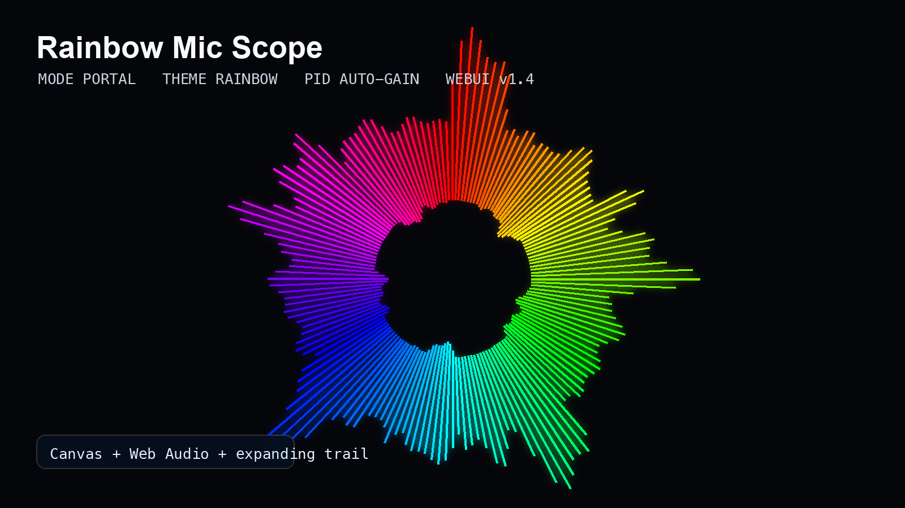

# Rainbow Mic Scope

Live microphone oscilloscope with rainbow WebUI, PID auto-gain, circular/portal modes, twin line, and expanding trail.



## What It Does

- Captures microphone input in real time.
- Draws raw waveform behavior without fake sine scaffolding.
- Includes `line`, `circle`, and `portal` modes.
- Uses PID-like auto-gain so quiet input is lifted and loud input is contained.
- Adds a twin/echo line and an expanding fading trail.
- Ships with both a Python/Matplotlib runtime and a browser WebUI.

## Run The WebUI

```bash
python3 -m http.server 4173 -d webui
```

Open:

```text
http://localhost:4173
```

Click `Start Mic` and allow microphone access.

## Phone Access

Best phone path:

```text
https://blackmvmba88.github.io/rainbow-mic-scope/
```

Local Docker path:

```bash
docker compose up --build
```

Then open from a device on the same Wi-Fi:

```text
http://192.168.101.100:4173
```

For details, see [docs/PHONE_ACCESS.md](docs/PHONE_ACCESS.md).

## Run The Python Visualizer

```bash
python3 -m venv .venv
.venv/bin/python -m pip install -r requirements.txt
./run_scope.sh --mode portal --window 4096 --render-points 720 --fps 24
```

## Useful Presets

```bash
./run_scope.sh --mode line
./run_scope.sh --mode circle --window 4096 --render-points 720 --fps 24
./run_scope.sh --mode portal --window 4096 --render-points 720 --fps 24 --trail-depth 18 --trail-fade-frames 140 --trail-expand 0.28
./run_scope.sh --mode portal --theme aurora --no-hud
```

## WebUI Controls

- `Line`, `Circle`, `Portal`: visual modes.
- `Theme`: rainbow, plasma, aurora, ghost, mono.
- `Fullscreen`: enter browser fullscreen.
- `Clean`: hide controls and HUD for capture/recording.
- `PNG`: export the current canvas frame.
- `REC`: record the canvas to WebM.
- `Save`: save the current settings as a browser preset.
- `Preset`: load built-in or saved presets.
- `Sensitivity`: PID target RMS.
- `Render`: visual bake points.
- `FPS`: browser render limit.
- `Trail`, `Fade`, `Expand`: echo behavior.
- `Twin`, `Trail`, `HUD`: live toggles.

## Python Keyboard Controls

- `space` / `tab`: cycle modes.
- `l`: line mode.
- `c`: circle mode.
- `p`: portal mode.
- `t`: cycle theme.
- `h`: toggle HUD.
- `g`: glow intensity.
- `e`: twin line.
- `f`: trail.
- `+` / `-`: line width.
- `up` / `down`: sensitivity.

## Release

See [docs/RELEASE_NOTES_v1.4.0.md](docs/RELEASE_NOTES_v1.4.0.md).
